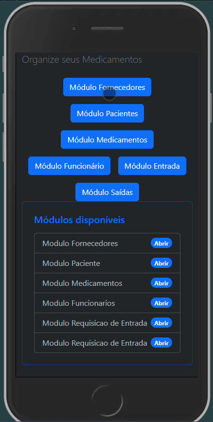

<div align="center">

# 💊 Controle De Medicamentos

### Sistema de gerenciamento de estoque farmacêutico em **ASP.NET MVC com POO**
Controle de fornecedores, pacientes, medicamentos, funcionários e movimentações de estoque com separação de responsabilidades e regras de negócio reais.

---


</div>

---

## 📌 Sobre o Projeto

O **Farmácia** é um sistema desenvolvido para facilitar o gerenciamento de estoque de uma unidade farmacêutica. A aplicação permite controlar fornecedores, pacientes, medicamentos e funcionários, além de registrar todas as movimentações de entrada e saída do estoque com rastreabilidade completa.

O projeto foi desenvolvido com foco em:

- Organização em camadas (MVC)
- Separação de responsabilidades
- Regras de negócio reais
- Encapsulamento e boas práticas de OOP
- Comunicação entre objetos
- Interface web responsiva e intuitiva

---

## 🎬 Demonstração

> Abaixo um GIF demonstrando o funcionamento da aplicação
<div align="center">



</div>
---

## ✅ Funcionalidades

### 🏭 Fornecedores

- Cadastro de fornecedores
- Visualização, edição e exclusão

**Regras:**
- Nome obrigatório (3 a 100 caracteres)
- Telefone obrigatório (formato válido)
- CNPJ obrigatório (14 dígitos)
- Não é permitido cadastrar dois fornecedores com o mesmo CNPJ

---

### 🧑‍⚕️ Pacientes

- Cadastro de pacientes
- Visualização, edição e exclusão

**Regras:**
- Nome obrigatório (3 a 100 caracteres)
- Telefone obrigatório (formato `(XX) XXXX-XXXX` ou `(XX) XXXXX-XXXX`)
- Cartão do SUS obrigatório (15 dígitos)
- CPF obrigatório (11 dígitos)
- Não é permitido cadastrar dois pacientes com o mesmo Cartão do SUS

---

### 💊 Medicamentos

- Cadastro de medicamentos
- Visualização, edição e exclusão
- Destaque visual para medicamentos com estoque baixo

**Regras:**
- Nome obrigatório (3 a 100 caracteres)
- Descrição obrigatória (5 a 255 caracteres)
- Quantidade em estoque obrigatória (número positivo)
- Fornecedor obrigatório
- Medicamentos com menos de 20 unidades são sinalizados como **"em falta"**
- A quantidade é atualizada automaticamente caso o medicamento já esteja cadastrado

---

### 👨‍💼 Funcionários

- Cadastro de funcionários
- Visualização, edição e exclusão

**Regras:**
- Nome obrigatório (3 a 100 caracteres)
- Telefone obrigatório (formato válido)
- CPF obrigatório (11 dígitos)
- Não é permitido cadastrar dois funcionários com o mesmo CPF

---

### 📦 Estoque

#### Requisições de Entrada

- Registro de novas entradas de medicamentos no estoque
- Visualização de todas as requisições de entrada

**Regras:**
- Data obrigatória e válida
- Medicamento obrigatório
- Funcionário responsável obrigatório
- Quantidade obrigatória (número positivo)
- O estoque é atualizado automaticamente ao registrar a entrada

#### Requisições de Saída

- Registro de saídas de medicamentos vinculadas a pacientes
- Visualização de todas as requisições de saída

**Regras:**
- Data obrigatória e válida
- Paciente obrigatório
- Medicamentos requisitados obrigatórios
- Não é permitido registrar saída que exceda o estoque disponível
- O estoque é subtraído automaticamente ao registrar a saída

---

## 🧠 Conceitos Aplicados

| Conceito | Aplicação |
|---|---|
| 🏗️ Classes e Objetos | Modelagem das entidades do sistema |
| 🔒 Encapsulamento | Proteção dos dados internos |
| 📐 Padrão MVC | Separação entre Model, View e Controller |
| ⚙️ Regras de Negócio | Validações, controle de estoque e restrições |
| 🔗 Comunicação entre Classes | Integração entre os módulos |
| 🌐 Aplicação Web | Interface responsiva via navegador |
| 💉 Injeção de Dependência | Baixo acoplamento entre as camadas |
| 🗂️ Camada de Serviços | Regras de negócio separadas dos Controllers |

---

## ⚙️ Tecnologias Utilizadas

- C#
- ASP.NET MVC
- Bootstrap
- AutoMapper
- Programação Orientada a Objetos (POO)

---

## ▶️ Como Executar

### 1. Clone o repositório

```bash
git clone https://github.com/PingDev-51/Controle_De_Medicamento_Web.git
```

### 2. Acesse a pasta do projeto

```bash
cd ControleDeMedicamento.WebApp
```

### 3. Execute o projeto

```bash
dotnet run --project ControleDeMedicamento.WebApp
```

### 4. Acesse no navegador

```
https://localhost:5001
```

---

## 📋 Requisitos

- .NET SDK instalado
- Visual Studio 2022 ou superior

---

## 🎯 Objetivo de Aprendizado

Este projeto foi desenvolvido para praticar:

- ✔️ Programação Orientada a Objetos
- ✔️ Padrão de arquitetura MVC
- ✔️ Desenvolvimento de aplicações web com ASP.NET
- ✔️ Estilização responsiva com Bootstrap
- ✔️ Modelagem de entidades reais com regras de negócio
- ✔️ Injeção de dependência e camada de serviços
- ✔️ Organização modular e código limpo

---

## 👨‍💻 Autores

<div align="center">

Desenvolvido como parte dos estudos em **C# e Programação Orientada a Objetos e Desenvolvimento Web** na **Academia do Programador**.

[](https://github.com/KauanGalvani)
[](https://github.com/k-silvax19)
</div>
